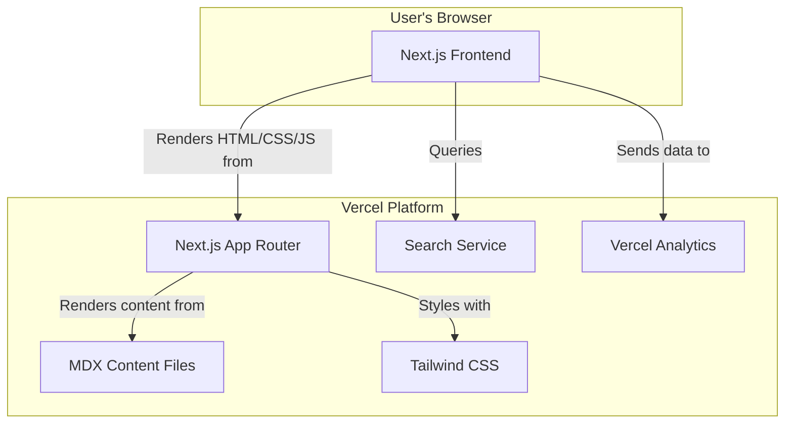

# Design Document: The Ultimate PostgreSQL Guide Website

## 1. Overview

This document outlines the technical design and architecture for "The Ultimate PostgreSQL Guide," a comprehensive, interactive, and free online resource for learning PostgreSQL. The website is designed to be a high-quality companion to a published book, targeting developers from beginner to expert levels.

The architecture prioritizes an excellent user experience, fast performance, and ease of content management. The design is modern, clean, and developer-centric, ensuring that the focus remains on the educational content.

## 2. High-Level Architecture

The website will be a static-first, server-rendered application built on the Vercel platform. This approach ensures optimal performance, SEO, and scalability.



### Technology Stack

- **Framework**: **Next.js (App Router)** for a server-centric, component-based architecture.
- **Styling**: **Tailwind CSS** for a utility-first, highly maintainable styling system.
- **Content**: **MDX (Markdown with JSX)** to allow for rich content formatting.
- **Search**: A dedicated search service for a fast, fuzzy, and content-aware search experience.
- **Deployment**: **Vercel** for seamless, automated deployments and hosting.
- **Analytics**: **Vercel Analytics** for privacy-focused usage tracking.

## 3. Component & UI Design

### 3.1. Layout & Navigation

- **Main Layout**: A three-column layout on desktop:
  1.  **Collapsible Sidebar**: Hierarchical navigation tree of all content.
  2.  **Main Content Area**: Renders the MDX content.
  3.  **On-Page TOC (optional)**: A right-hand sidebar showing headings for the current page.
- **Top Navigation Bar**: Contains the logo, primary links, search bar access, and a light/dark mode theme toggle.
- **Footer**: Contains links to "About," "GitHub," and other relevant resources.
- **Responsiveness**: The layout will adapt fluidly to smaller screens. The sidebar will collapse into a hamburger menu on mobile devices.

### 3.2. Core Components

- **CodeBlock**: A React component that wraps code snippets, providing syntax highlighting (e.g., using `rehype-pretty-code`) and a "Copy to Clipboard" button.
- **Alert/Callout**: A component to render styled blocks for notes, tips, and warnings.
- **SearchModal**: A full-screen modal or dropdown that provides instant search results as the user types.

### 3.3. Design System & Aesthetics

- **Color Palette**:
  - **Light Mode**: Off-white/light gray background, dark text.
  - **Dark Mode**: Dark slate/charcoal background, light text.
  - **Accent**: A vibrant color (e.g., PostgreSQL blue) for interactive elements.
- **Typography**:
  - **Body**: A highly legible sans-serif font (e.g., Inter).
  - **Code**: A clean monospaced font with ligatures (e.g., Fira Code).
- **Overall Feel**: Minimalist, professional, and focused on readability to build trust and authority.

## 4. Content Architecture

The content will be structured hierarchically in the file system using MDX files. This structure will directly map to the URL paths and the sidebar navigation.

```
/content
├── 01-fundamentals
│   ├── 01-introduction.mdx
│   ├── 02-installation.mdx
│   └── ...
├── 02-intermediate-sql
│   ├── 01-joins.mdx
│   └── ...
├── 03-advanced-topics
│   └── ...
└── 04-administration
    └── ...
```

- **Metadata**: Each MDX file will contain frontmatter (e.g., using YAML) to specify the title, description, and publication date.
- **"Last Updated" Timestamp**: This will be generated automatically based on the Git commit history for each file.

## 5. Data Models (Conceptual)

The primary data model is the content itself, structured as a tree. There is no traditional database for the website's core content.
